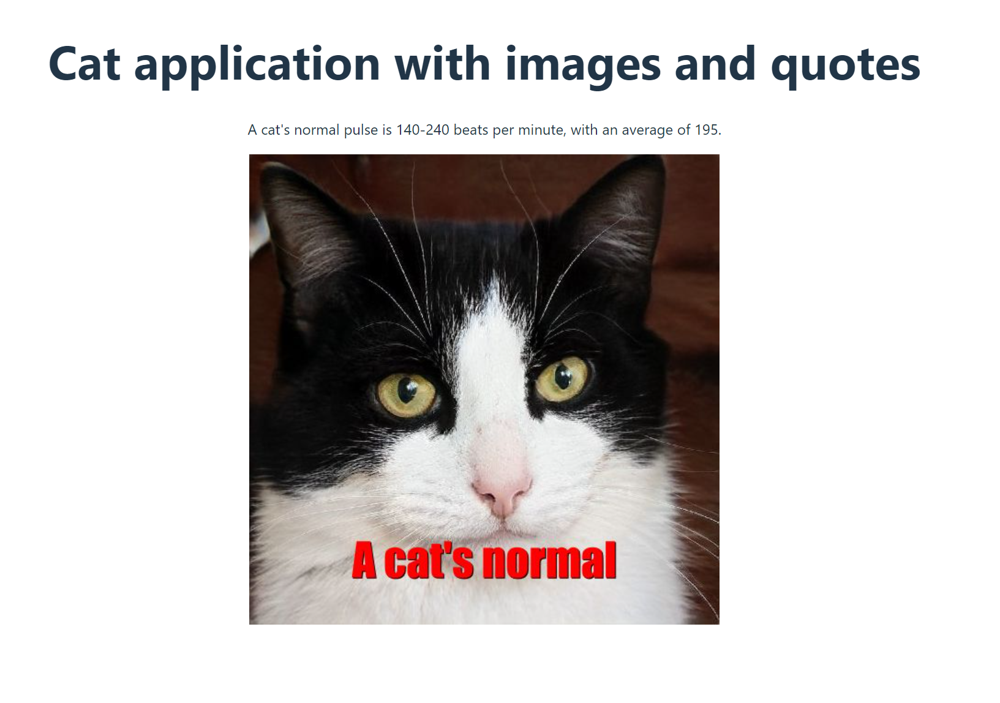

## CatFactsImage

The CatFactsImage is a web application developed in React that combines random cat facts with cat images. It uses two different APIs: one to fetch random cat facts and another to fetch cat images along with the first 3 words of the retrieved fact.

APIs:

- Facts Random: https://catfact.ninja/fact
- Imagen Random: https://cataas.com/cat/says/hello

Retrieve a random cat fact from the first API and display an image of a cat with the first word of the retrieved fact using the second API.

## App

